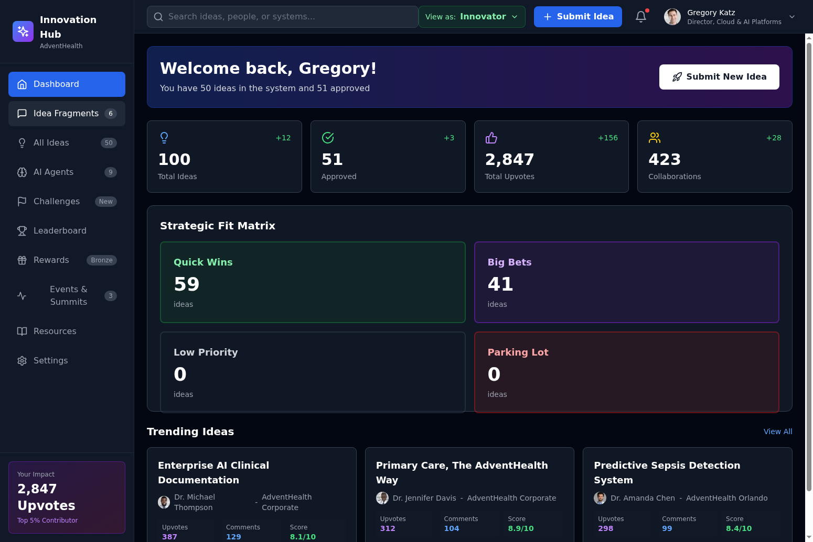
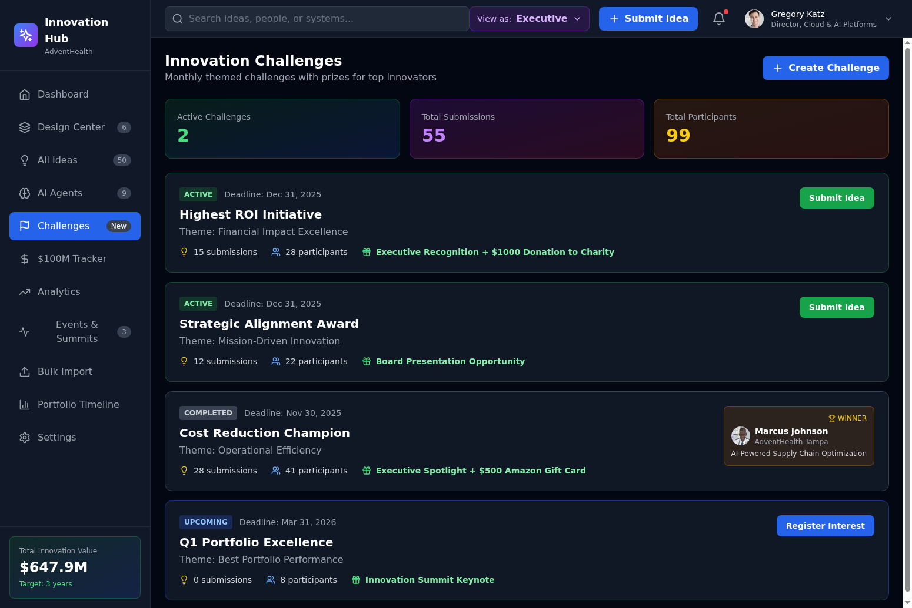
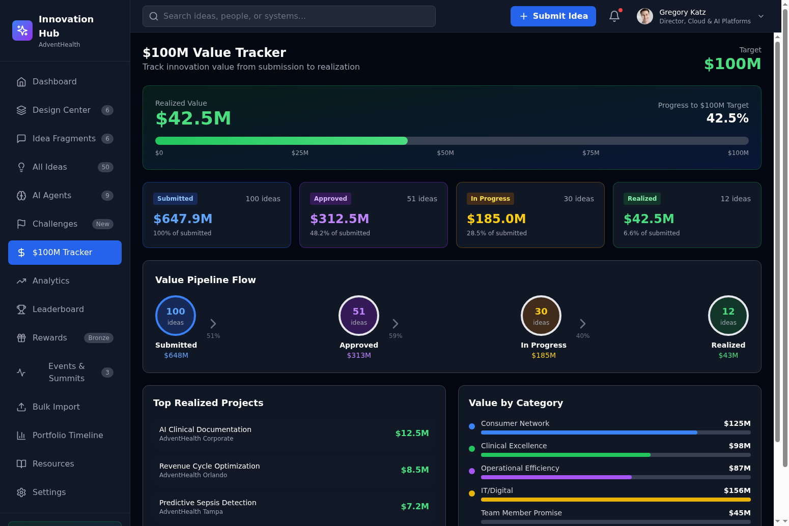

# ContosoHealth Innovation Hub

A comprehensive healthcare innovation management platform that enables organizations to capture, evaluate, and scale innovative ideas from across the enterprise.

## Value Proposition

The ContosoHealth Innovation Hub transforms how healthcare organizations manage innovation by providing a unified platform that connects frontline innovators with executive decision-makers. The platform delivers measurable business value through streamlined idea capture and evaluation, AI-powered analysis and recommendations, portfolio management with $100M+ value tracking, and gamification that drives engagement across the organization.

The platform currently manages 100 ideas representing $647.9M in potential value, with 51 approved initiatives and an average ROI of 26.3:1. The Strategic Fit Matrix automatically categorizes ideas into Quick Wins (59 ideas) and Big Bets (41 ideas) based on value and effort scoring.

## Requirements Met

The platform implements all core requirements from the original specification documents.

### Idea Management
The system supports full idea lifecycle management from initial fragments through approved initiatives. Ideas can be submitted as rough thoughts that mature through crowdsourcing conversations before AI analysis. Each idea includes problem statements, proposed solutions, expected benefits, and comprehensive metadata including department, hospital, track assignment, and phase status.

### AI Agent Suite
Nine specialized AI agents powered by Azure OpenAI (GPT-5.1 Codex and GPT-4.1) provide intelligent analysis. The AI Coach offers phase-specific guidance and answers questions about innovation best practices. The Feasibility Scorer evaluates technical, financial, strategic, organizational, and timeline dimensions. The Similarity Matcher uses ChromaDB vector embeddings to find related ideas and prevent duplication. The Solution Architecture Generator creates Microsoft Azure architecture diagrams with building blocks for Azure OpenAI, AI Search, Cosmos DB, App Service, and other services. The Resource Optimizer uses Microsoft Lightning RL concepts for team matching and budget allocation. The BRD Generator creates comprehensive business requirements documents. The Notification Intelligence agent manages stakeholder communications. The Risk Analyzer identifies potential implementation risks. The ROI Calculator provides detailed financial projections.

### Dual-Persona System
The platform supports two distinct user experiences. The Innovator view focuses on idea submission, collaboration, upvotes, and community engagement. The Executive view emphasizes portfolio management, financial metrics, ROI tracking, and strategic alignment. Users can switch between personas using the dropdown in the header, with Innovator as the default.

### 6-Dimension Rubric System
Ideas are evaluated across six dimensions divided into Value (Emotional Needs, Revenue Impact) and Effort (Systemic Change, Pilot Complexity, People Build, Technology/CAPEX). AI-recommended scores can be adjusted manually, and the system automatically calculates quadrant placement for the Strategic Fit Matrix.

### Design Center Pipeline
A 6-stage innovation workflow (Define, Research, Co-Create, Design Value, Prototype, Pilot) with gate approvals tracks ideas through the innovation process. Each stage shows project counts and aggregate value, with visual indicators for stage progression.

### Gamification and Rewards
The platform includes a comprehensive rewards system with Bronze, Silver, Gold, and Platinum tiers. Users earn points for submitting ideas, receiving upvotes, adding comments, and having ideas approved. Rewards can be redeemed for Starbucks and Amazon gift cards ranging from $15 to $100.

### Analytics Dashboard
Executive-level analytics include KPI cards (Total Ideas, Approved, Total Value, Avg ROI, Engagement), ideas over time trends, value by category breakdown, status distribution, agent performance metrics, hospital comparison, and ROI distribution analysis.

### Events and Summits
The platform manages innovation events including summits, workshops, bootcamps, and showcases. Executive view shows high registration indicators for events with 100+ attendees.

### Bulk Import
Excel-based bulk import supports importing multiple ideas at once with a standardized template including Title, Description, Department, Hospital, Submitter Name, Email, Estimated Value, and Category fields.

### Portfolio Timeline
A Gantt-style timeline view shows project schedules across quarters with status indicators (On Track, At Risk, Delayed, Completed) and value tracking.

## Innovations and New Features

### Persona-Based Navigation
The dual-persona system provides tailored experiences for different user types. Innovators see engagement metrics (upvotes, collaborations, comments) while Executives see financial metrics (value, ROI, cost savings). The sidebar dynamically filters to show only relevant navigation items for each persona.

### Persona-Specific Challenges
Challenges are tailored to each audience. Innovator challenges include Best Patient Safety Idea, Most Creative Solution, Community Choice Award, and Team Collaboration Challenge. Executive challenges include Highest ROI Initiative, Strategic Alignment Award, Cost Reduction Champion, and Portfolio Excellence.

### Idea Fragments with Crowdsourcing
Rough idea fragments can be shared for community input before becoming formal ideas. Fragments support threaded discussions, upvoting, and promotion to full ideas when they reach sufficient maturity.

### Multi-Model AI Architecture
The platform intelligently selects AI models based on task requirements. GPT-5.1 Codex handles structured outputs like architecture diagrams and BRDs. GPT-4.1 provides conversational reasoning for coaching and analysis. Text-embedding-ada-002 powers semantic search and similarity matching.

### Microsoft Azure Architecture Building Blocks
The Solution Architecture Generator creates diagrams using standard Microsoft Azure components including Azure OpenAI Service, Azure AI Search, Azure Cosmos DB, Azure App Service, Azure Functions, Azure Storage, Azure Key Vault, and Azure Monitor.

### Real-Time Value Tracking
The $100M Value Tracker shows pipeline progression from Submitted through Approved, In Progress, and Realized stages with aggregate values and progress toward the target.

### Headshot Integration
All user avatars display professional headshots matched by name, gender, and ethnicity for a polished, realistic demo experience.

## Navigation Guide

### Header
The header contains the search bar for finding ideas and people, the persona switcher dropdown to toggle between Innovator and Executive views, the Submit Idea button, notifications bell, and user profile menu.

### Sidebar (Innovator View)
Dashboard provides an overview with engagement metrics and trending ideas. Idea Fragments shows rough ideas being crowdsourced. All Ideas displays the complete idea list with filtering. AI Agents provides access to all 9 AI analysis tools. Challenges shows community challenges with prizes. Leaderboard ranks top contributors. Rewards displays earned points and redeemable gift cards. Events & Summits lists upcoming innovation events. Resources provides helpful documentation. Settings manages user preferences.

### Sidebar (Executive View)
Dashboard provides an overview with financial metrics and portfolio status. Design Center shows the 6-stage innovation pipeline. All Ideas displays the complete idea list with filtering. AI Agents provides access to all 9 AI analysis tools. Challenges shows executive-focused challenges. $100M Tracker displays value realization progress. Analytics provides comprehensive dashboards and charts. Events & Summits lists upcoming events with registration indicators. Bulk Import enables Excel-based idea import. Portfolio Timeline shows Gantt-style project schedules. Settings manages user preferences.

### Idea Detail Drawer
Clicking any idea opens a slide-out drawer with full details including problem statement, proposed solution, expected benefits, deliverable artifacts, Strategic Fit Rubric with 6-dimension scoring, discussion threads, and the Run Full AI Analysis button.

## Screenshots

### Innovator Dashboard

The Innovator view shows engagement-focused metrics including Total Upvotes and Collaborations instead of financial values.

### Executive Dashboard

The Executive view displays financial metrics including Total Value ($647.9M) and Average ROI (26.3:1).

### Executive Challenges

Executive-specific challenges focus on ROI, strategic alignment, and cost reduction.

### Design Center Pipeline

The 6-stage innovation workflow with gate approvals and value tracking.

## Technical Stack

The frontend is built with React 18, TypeScript, Vite, Tailwind CSS, Recharts for data visualization, and Lucide React for icons. The backend uses Python FastAPI with Azure OpenAI integration (GPT-5.1 Codex, GPT-4.1), ChromaDB for vector embeddings and semantic search, and an in-memory SQLite database for demo purposes.

## Deployment

Frontend: https://file-attachment-manager-yjeh37bp.devinapps.com
Backend API: https://app-rixbgcke.fly.dev

## Getting Started

Visit the frontend URL and explore the platform. Use the persona switcher in the header to toggle between Innovator and Executive views. Click on any idea to see full details and run AI analysis. Submit new ideas using the Submit Idea button. Explore the various views in the sidebar to see all platform capabilities.
